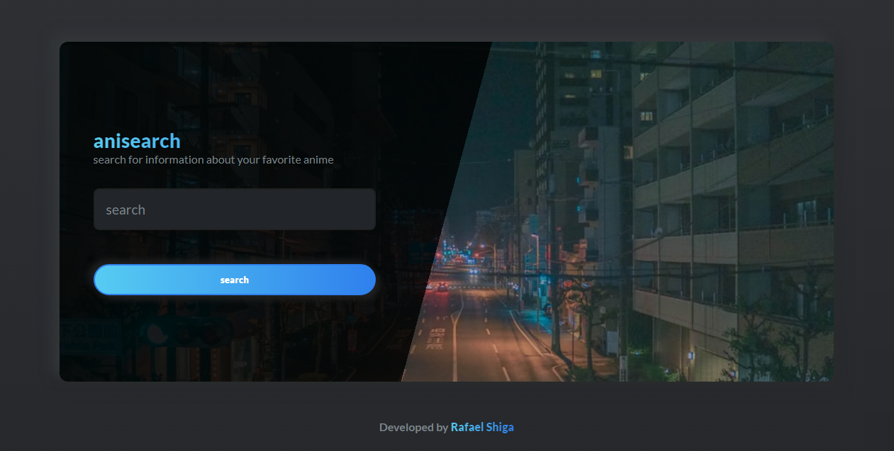

<h1 align="center">
  
   
   
  anisearch
</h1>

<h3 align="center">
<strong>search for information about your favorite anime</strong>
</h3>

  
  
  
  
   
   
  <a href="#space_invader-technologies">Technologies</a>
   
   
  
   
   

## :space_invader: Technologies

- [ReactJS](https://pt-br.reactjs.org/)
- Typescript
- [React Router](https://reacttraining.com/react-router/web/guides/quick-start)
- [Axios](https://github.com/axios/axios)
- [React Icons](https://react-icons.github.io/react-icons/)
- [Styled components](https://styled-components.com/)
- [React Switch](https://github.com/markusenglund/react-switch#readme)
- [Jikan API](https://jikan.moe/)
- [Yup](https://github.com/jquense/yup)
